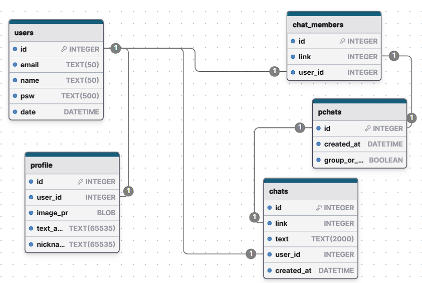

# Мессенджер на Flask

# Встроенный функционал

1. **Аутентификация и регистрация.** Проверка введенных значений с помощью Flask форм. Хеширование паролей с помощью werkzeug.
   Возможность сохранения текущей сессии. Использование Flask sqlAlchemy для большей универсальности работы с базами данных

2. **Страница профиля пользователя.** Позволяет увидеть аватар и информацию текущего пользователя. Предусмотрена 
возможность редактирования информации о себе, в том числе замена дефолтного аватара в модальном окне

3. **Поиск зарегистрированных пользователей. Поиск можно осуществлять по имени или userнейму. Кликабельные аватарки для
перехода в профиль конкретного пользователя

4. **Возможность писать личные сообщения.** Просмотр информации о конкретном пользователе

5. **Реализация чата в реалтайм с помощью Flask jsonify.** Кликабельные аватары в шапке чата

6. **Отображение страницы сохраненных чатов пользователя.** Защита переписок по url обходам

### Реализация связей таблиц в БД
